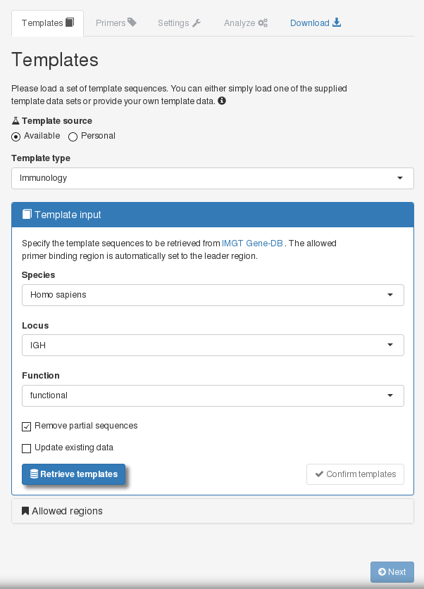

```{r vignette_options, echo = FALSE, message = FALSE, warning = FALSE}
knitr::opts_chunk$set(collapse = TRUE, comment = "#>")
```

openPrimeRui provides a Shiny application that provides functionalities for designing and analyzing multiplex polymerase chain reaction (PCR) primers. In the following, we give an overview of how the user-interface can be used for the main application scenarios of the tool: evaluating a primer set, comparing primer sets, and designing novel primer sets.

# Preliminaries

`openPrimeRui` provides a user-interface to the funcionalities that are provided by the `openPrimeR` package. Therefore, `openPrimeR` is automatically installed when installing `openPrimeRui`. Note that `openPrimeR` requires external tools for some of its functionalities; please take a look at the dependencies of the package, which are described in the openPrimeR vignette. In case that external tools are missing, the Shiny application will automatically create a pop-up informing you about the missing dependencies. Rows in the table shown in the pop-up that have cells with a blue background indicate external tools that are available on the system, while cells with a red background indicate dependencies that are not available. Each row in the table indicates the functionalities that are provided by the third-party tools and URLs for downloading the tools are provided.


# Starting the Shiny app

`openPrimeRui` exports only a single function, `startApp()`, which is used to start the openPrimeR shiny application:

```{r check_dependencies, message = FALSE, warning = FALSE, eval = FALSE}
library(openPrimeR)
startApp()
```

Calling `startApp()` should open the Shiny application as a new tab in your default browser. If this is not the case, please consider the console output and manually open the displayed URL in your preferred web browser. 

# Overview of the user-interface

Once the Shiny application has loaded, you will see the user interface of the tool, which is based on a two-column layout. The shaded panel on the left hand side is intended for performing actions such as loading data and performing analyses, while the right hand side shows information on the loaded data and the analysis results. Therefore, in the following we will refer to these two panels as the *action panel* and *view panel*, respectively.


General navigation is possible through the symbols shown in the top-right of the screen. There are three icons: the factory icon, the refresh icon, and the power-off icon. With the factory icon, you can open the overview of third-party tools, which is displayed at startup if there are missing tools. Using the refresh icon, you can reset your current session and the power-off button closes the application. 


To the right of the logo, there are two navigation selectors. 


The selector on the left side is used to select the analysis mode of the tool, while the selector on the right side determines the data that you would like to view. With the analysis selector, you can select one of three modes of analysis:

* **Evaluation:** Analyze the properties of an existing primer set.
* **Design:** Create a novel set of primers targeting multiple templates at the same time.
* **Comparison:** Compare the properties of multiple existing primer sets.

By default, the evaluation mode is selected. For the set selector, there are also three possible choices, which determine the data you are currently viewing:

* **All data:** Show results for the complete set of currently loaded primers.
* **Filtered data:** Show results for a primer set that has been filtered.
* **Design data:** Show results for a newly designed primer set.

By default, all of the loaded data are displayed. The set selector can be a useful tool to compare the properties of a primer set before and after filtering. Note, however, that only available data can be shown. For example when you can only view the filtered data set after having computed it earlier. Note that if an operation such as filtering or designing is performed, the set selector automatically switches to the corresponding data.

Next, let us take a look at how you can navigate through the tool when conducting an analysis, starting with the action panel. 



Idependent of the type of analysis, the action panel takes you through a sequence of four steps, which are indicated by elements at the top of the panel. 


* **1. Templates:** The template sequences that you would like to analyze. If you are evaluating or designing primers, you need to provide a single set of templates. For comparing multiple primer sets, you may also provide multiple sets of templates.
* **2. Primers:** If you are evaluating or comparing primer sets, you should provide either a single primer set or multiple primer sets for the analysis. For designing primers, you can specify the desired, basic properties of the primers here.
* **3. Settings:** The settings for conducting an analysis encompass which properties of the primers are considered and how they are computed.
* **4. Analyze:** Here, you can conduct an analysis corresponding to the selected analysis mode. For example, when you are evaluating a single primer set, you can filter the input primer set according to the properties of the primers.
* **Download:** This tab allows you to download the analysis results to your disk.

The idea for navigating along the analysis sequence is that it is possible to navigate to the next analysis step only if appropriate data were provided for the current step in the sequence. For example, when you are in the first stage of the sequence you need to upload a set of templates, after which you can go on to the next step of the sequence, which is providing the primer data. Before providing more detail on the individual steps along the analysis sequence, let us consider how to navigate the view panel.

In contrast to the action panel, the view panel can be navigated freely without any restrictions on the order in which elements must be selected. The view panel has the following elements:


* **Templates:** An overview of the loaded template sequences.
* **Primers:** An overview of the loaded oligomers.
* **Coverage:** Statistics on the coverage of the templates with respect to the templates.
* **Constraints:** Statistics on the properties of the primers.
* **Comparison:** Results from comparing multiple primer sets.
* **Settings:** Overview of loaded analysis settings.
* **Help:** Internal help pages of the tool.

With this, we have covered the core elements of the user interface, which do not change dynamically. In the following will give an overview of the tool with regard to individual analysis modes. Note that we will not cover all available elements of the user interface here due to the complexity of the tool.

# Evaluating a set of primers
