```{r vignette_options, echo = FALSE, message = FALSE, warning = FALSE}
knitr::opts_chunk$set(collapse = TRUE, comment = "#>")
```

*openPrimeRui* provides a Shiny application for the *openPrimeR* package, which offers functionalities for designing and analyzing multiplex polymerase chain reaction (PCR) primer sets. In the following, we illustrate how to navigate the user-interface for three application scenarios: evaluating a primer set, comparing primer sets, and designing novel primer sets.

# Preliminaries

Since *openPrimeRui* provides a user-interface for the functionalities of the *openPrimeR* package, *openPrimeR* is automatically installed when *openPrimeRui* is installed. Note, however, that *openPrimeR* requires external tools for some of its functionalities; you can learn more about the dependencies in the package's vignette. 

In case that external tools are missing, the Shiny application automatically creates a pop-up informing you about any missing dependencies. Rows in the table with blue-colored cells indicate installed external tools, while red-colored cells indicate dependencies that are not available. Each row in the table is annotated with the functionality that is provided by the corresponding dependency such that it is easy to see, which features are not available in case of missing dependencies.

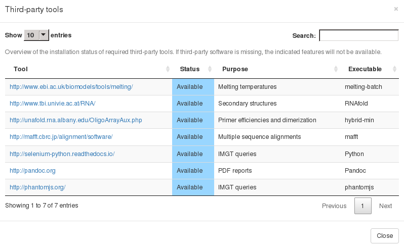


# Starting the Shiny app

*openPrimeRui* exports only a single function, `startApp()`, which is used to open the shiny application:

```{r check_dependencies, message = FALSE, warning = FALSE, eval = FALSE}
library(openPrimeR)
startApp()
```

After calling `startApp()`, the Shiny application should open as a new tab in your default browser. If this is not the case, please consider the console output and manually open the displayed URL (a certain port on *localhost*) in your preferred web browser. 

# Overview of the user-interface

The user interface of the app is based on a two-column layout. The shaded panel on the left hand side is intended for performing actions such as loading data and performing analyses, while the right hand side shows information on the loaded data and the analysis results. Therefore, in the following we will refer to these two panels as the *action panel* and *view panel*, respectively.

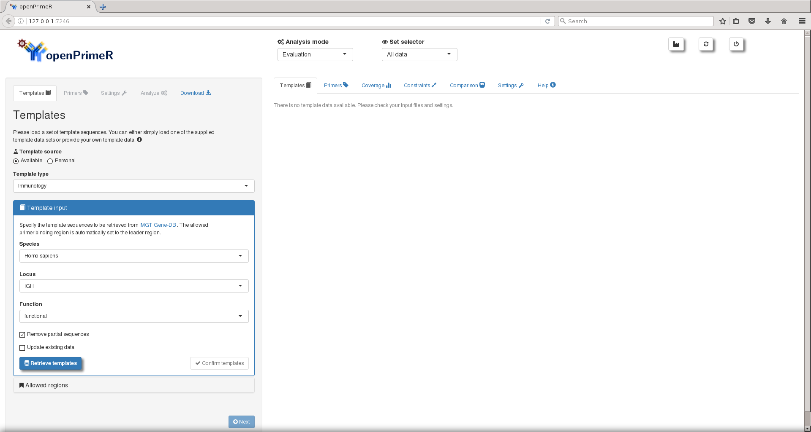

General navigation is possible through the symbols shown in the top-right corner of the screen, where three icons are shown: the factory icon, the refresh icon, and the power-off icon. With the factory icon, you can open the overview of third-party tools, which is shown at startup if there are missing dependencies. Using the refresh icon, you can reset the current session and clicking on the power-off button closes the application. 


To the right of the *openPrimeR* logo and above the view panel, there are two navigation selectors. 

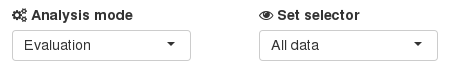

The selector on the left side is used to select the analysis mode of the tool, while the selector on the right side determines the data that are shown. With the analysis selector, you can select one of three modes of analysis:

* **Evaluation:** Analyze the properties of an existing primer set.
* **Design:** Create a novel set of primers targeting multiple templates at the same time.
* **Comparison:** Compare the properties of multiple, evaluated primer sets.

By default, the evaluation mode is selected. For the set selector, there are also three possible choices, which determine the data you are currently viewing:

* **All data:** Show results for the complete set of currently loaded primers.
* **Filtered data:** Show results for a primer set that has been filtered.
* **Design data:** Show results for a newly designed primer set.

By default, all of the loaded data are displayed. The set selector can be a useful tool to compare the properties of a primer set before and after filtering. When using the data selector, note that only available data can be shown. For example, information on a filtered set of primers can only be shown after a filtering operation has been performed. In many cases, it is not necessary to manually change the selected data set because operations such as filtering an designing primers will automatically select the corresponding data sets.

Next, let us take a look at how you can navigate through the tool when conducting an analysis, starting with the action panel. Independent of the type of analysis, the action panel takes you through a sequence of four steps, which are indicated by the elements at the top of the panel:


* **1. Templates:** In the templates panel, you can provide the template sequences that you would like to analyze. If you are evaluating or designing primers, you need to provide a single set of templates. For comparing multiple primer sets, you may also provide multiple sets of templates.
* **2. Primers:** In the primers panel, you can define the primers that you would like to analyze. If you are evaluating or comparing primer sets, you should provide either a single primer set or multiple primer sets for the analysis. For designing primers, you can specify the desired, basic properties of the primers here.
* **3. Settings:** In the settings panel, you can specify the settings for conducting an analysis. For example, you can determine which properties of the primers are considered and how they are computed.
* **4. Analyze:** Using the analyze panel, you can access functionalities for conducting an analysis based on the chosen analysis mode. For example, when evaluating a primer set, you can filter the primers according to their properties.
* **Download:** This tab allows you to download the analysis results to your disk.

We require that each navigation step is performed in the displayed sequence. For example, in the first stage, you are required to upload the template sequences and you can only go to the second step (the primers stage) after you have provided the templates. Before providing more detail on the individual steps along the analysis sequence, let us take a look at the view panel.

In contrast to the action panel, the view panel can be navigated freely without any restrictions on the order in which elements must be selected. The view panel has the following elements:


* **Templates:** An overview of the loaded template sequences.
* **Primers:** An overview of the loaded oligomers.
* **Coverage:** Statistics on the coverage of the templates with respect to the templates.
* **Constraints:** Statistics on the properties of the primers.
* **Comparison:** Results from comparing multiple primer sets.
* **Settings:** Overview of loaded analysis settings.
* **Help:** Internal help pages of the tool.

At any point in time during an analysis, you can use the view navigation panel to retrieve the results you are interested in. For example, after you have determined the coverage of the templates, you can select the coverage tab to view information on the coverage. 

With this, we have covered the core elements of the user interface, which do not change dynamically. We will now move on to the required steps for each analysis mode. Note that, in the following, we will not cover all available elements of the user interface due to the complexity of the tool.

# Templates
All analyses start with the upload of a set of templates. You can either load one of the supplied sets of templates or you can provide your own template sequences. You can select your choice via the the template source selector:


## Loading supplied template sequences
If you are loading a supplied set of templates, you can simply specify the type of template sequences to load. For example, to load immunological template sequences, you can select `Immunology` in the template type selector and then select the species, locus, and function of the immunoglobulin sequences you would like to retrieve with the `Retrieve templates` button. 

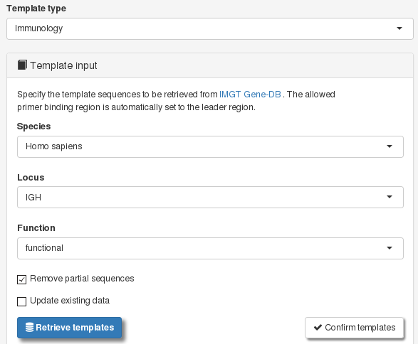

## Loading personal template sequences

Loading personal templates is possible in two ways: by supplying a [FASTA](https://en.wikipedia.org/wiki/FASTA_format) file containing the template sequences or by loading a [CSV](https://en.wikipedia.org/wiki/Comma-separated_values) file containing a set of templates that was loaded via *openPrimeR*. For FASTA input, it may be beneficial to load the metadata encoded in the FASTA headers. In particular, if you want to interpret the analysis results with respect to groupings of the templates, you should make sure that you specify how information on the template grouping is encoded in the FASTA headers. For this, the `GROUP` field should be defined correctly.

For a better understanding, let's consider the following FASTA header:

> \>K03455_SubtypeB_HIV-1

This sample has a header structure consisting of `ACCESSION`, `GROUP`, and `SPECIES`, where each field is delimited by an underscore (`_`). Hence, you would define the following header structure in the tool such that the metadata can be loaded correctly:

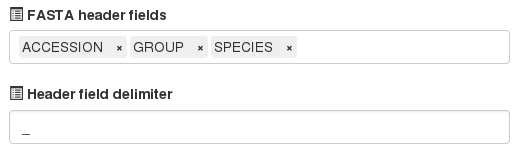

Having defined the header structure, you can upload the templates via the template file selector:


## Defining the target binding regions

Having provided a set of template, you should define the target binding regions of the primers in the templates. This is done through the `Allowed regions` panel. Here, you can either provide template-specific binding regions or uniform binding ranges. To define individual template binding regions, you can supply FASTA files providing the binding regions for forward and reverse primers, respectively. When providing the files, please ensure that the headers of the FASTA files match the headers of the templates and that the provided sequences are subsequences of the templates.

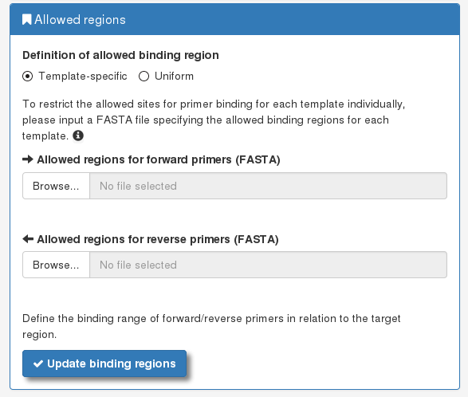

Uniform binding ranges are specified in the form of intervals relative to the 5' end for forward primers and relative to the 3' end for reverse primers. For example, a forward binding interval of [1,30] indicates the the forward primers should bind to the first 30 bases of the templates, while a reverse binding interval of [1,40] indicates the the reverse primers should bind in the last 40 bases of the templates. Your adjustments come into effect when the `Update binding regions` button is pressed.

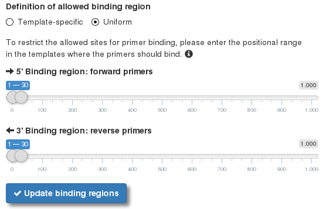

## Loading templates for comparison

For comparing primer sets, the input of templates is slightly different to the other modes. Again, you can choose to either load supplied or personal templates. This time, however, the template sequences have to be provided as CSV files representing sets of templates that have been previously loaded by openPrimeR. This ensure that the binding regions are already defined. You can obtain a CSV file for a set of loaded template sequences using the download tab by selecting *Templates* as the data set, selecting the *Raw* output format, and then clicking on the `Download` button.

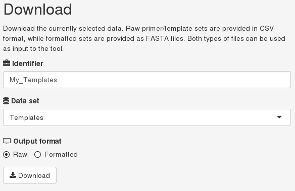

If you should ever need to, you can also download the templates in FASTA format, by switching from *Raw* to the *Formatted* output in the download panel.

With regard to comparing primer sets, the input of the templates is dependent on whether you would like to compare primer sets targeting the same templates or different sets of templates. If all the primer sets relate to the same set of templates, then it is sufficient to provide a single template set for all primers. If, however, the primer sets relate to different template sets, you should provide one set of templates for every set of primers you would like to consider.

## The templates tab

After you have uploaded a set of templates in the evaluation/design modes, you can use the templates tab that the correct data haven been loaded. Apart from the basic information on the templates such as their identifiers and sequences, you can also find annotations of the target binding regions. For example, the columns `Allowed Binding Range (fw)` and `Allowed Binding Range (rev)` provide the defined binding ranges of forward and reverse primers, respectively. You can view additional information on the templates by clicking on the green `+` icon. Note that the templates table is annotated with information on the coverage, once an analysis has been performed.

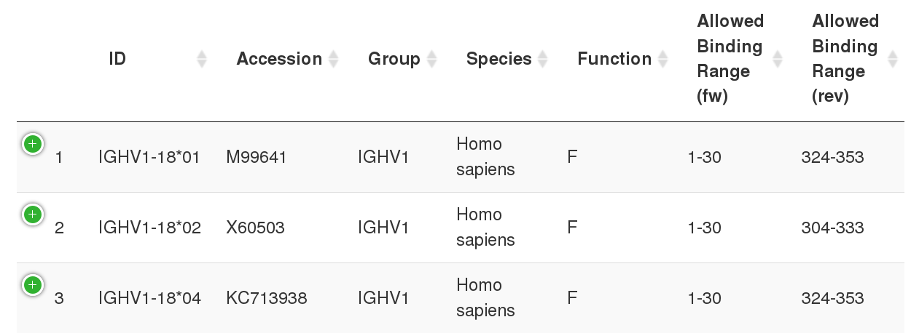

# Primers

The content of the primers panel considerably depends on the analysis mode. Hence, we will cover the contents of the primers panel for every analysis mode individually.

## Primers: evaluation
If you choose to load a supplied set of primers, you can either load the primers in their evaluated form (i.e. annotated with analysis results) or in their raw form. Analogously, you can provide your own sets of primers either in FASTA format (raw) or in CSV format (evaluated) if you have already evaluated the primer set previously and would like to review the results. 

When you choose to upload the set of primers as a CSV file, which was stored using the app's download panel, you do not need to provide any additional inputs.
For FASTA input, on the other hand, you should define identifiers for the directionalities of the primers beforee uploading a file. In the following screenshot, the annotation means that all forward primers contain the keyword *_fw* in their FASTA headers, while all reverse primers contain the keyword *_rev* in their headers. Pairs of primers can be identified by providing two oligomers whose headers match when removing the directionality keywords.

When providing a FASTA file as the input, you can also specify how IUPAC how ambiguities in the primers are to be treated. By default, ambiguous IUPAC bases are loaded as they are, but you can also choose to merge primers using ambiguous bases or disambiguate the input oligomers, if possible. 

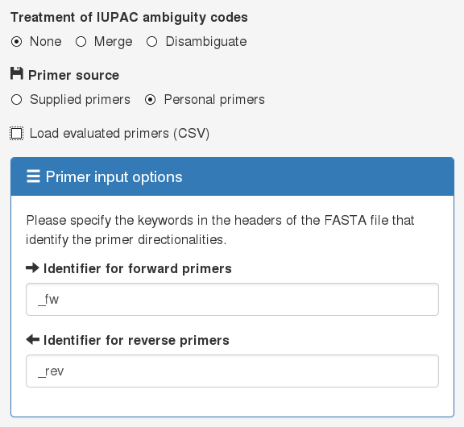

After uploading a set of primers , information on the primers is shown in the primers tab.

## The primers tab

The primers tab shows all information pertaining to the loaded primers. The directionalities of the primers are color-coded such that forward primers, reverse primers, and pairs of primers can be distinguished easily. 

The *Coverage mode* indicator, which is found in the bottom-right corner of the screen, shows how the coverage of the templates is computed. If primers of both directionalities (forward and reverse) are provided, the coverage mode is *both* meaning that a template is considered to be covered if there is at least one forward and at least one reverse primer covering the template. Otherwise, if only primers of a single directionality (either only forward or reverse primers) are provided, a single primer covering a template is sufficient.

Once the coverage of the primers has been computed, you can switch between viewing the coverage for groups of template and viewing the coverage of individual templates via the `Show individual primer coverage` selector. More information on the primers can be retrieved by clicking on the green `+` in front of each row in the table.

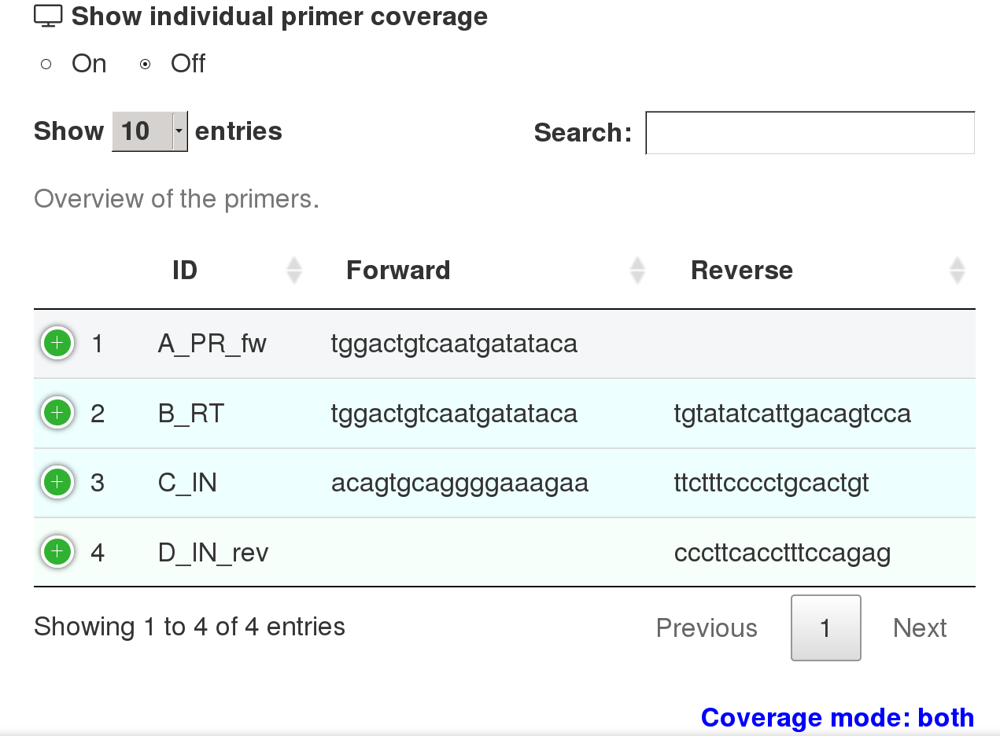

## Primers: design

When designing primers, the primers panel is used to specify the desired properties of the primers. The two most important considerations are the following:

* **Template sequence relationship:** Specify whether the template sequences are rather related or divergent. For related template sequences, degenerate oligomers are constructed in an effort to improve the coverage of the primers. For divergent templates, on the other hand, primers are initialized as substrings from the input templates.
* **Target strands for design:** This selector determines whether primers are designed for both DNA strands such that forward and reverse primers are designed or whether only primers for a single strand (either forward or reverse) shall be constructed.

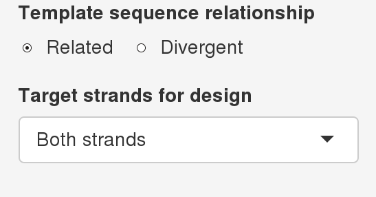

## Primers: comparison

Primer sets for comparison can be supplied only in their evaluated form in terms of a CSV file. You can load several sets of primers by either successively loading individual CSV files or selecting multiple CSV files at once. Once you have uploaded a set of primers, the comparison tab provides an overview of all loaded template and primer sets by providing the coverage of each set. 

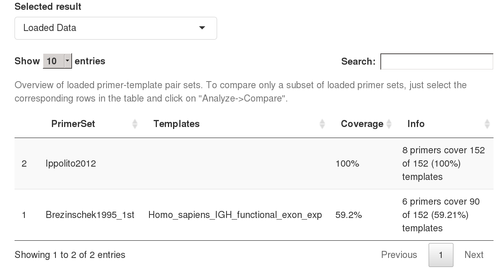

As stated earlier, a single set of templates suffices in case that all primer sets relate to the same set of templates. Otherwise, there should be a one-to-one mapping between primer sets and sets of templates.

# Settings

Having supplied both templates and primers, the next step is the definition of the analysis settings. These settings define which primer properties are considered and how they are computed. The first choice you have to make is whether you want to load one of the provided default analysis settings or whether you would like to load your personal settings. 

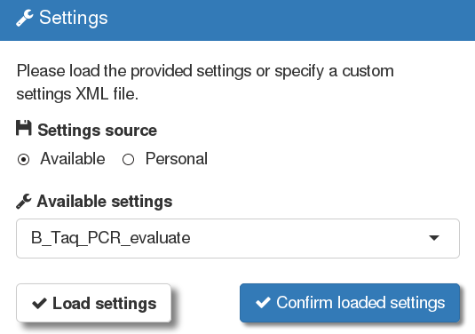

Personal settings can be provided as XML files, which can be retrieved using the app's download panel. Having loaded a settings file, an overview of the currently active settings is shown in the settings tab (view panel).

## Coverage conditions

The coverage conditions define under which circumstances a template sequence is considered to be covered by a primer. We differentiate between basic and extended coverage conditions. 

### Basic coverage conditions

With the basic coverage conditions you can define where the primers should bind and how many mismatches between primers and templates are allowed. By default, the allowed off-target coverage ratio is set to 100% such that the coverage of primers is evaluated across the full template sequences (i.e. independent of the annotated binding regions). To consider only coverage events in the target regions, you can set the ratio of allowed off-target binding events to 0%. Independent of this selection, the specificity of the primers is evaluated with respect to the number of primers binding the target region vs those binding in other regions.

The other important parameter is the maximal number of allowed mismatches between primers and templates. This setting limits the potential coverage events that can be detected. For example, if you set the number of allowed mismatches to 0, it is only possible to identify all binding modes where templates and primers are 100% complementary. To capture also mismatch binding events, a larger number of allowed mismatches is required. For example, if the maximal number of allowed mismatches is set to 7, according to the basic coverage conditions, all binding events with less or equal to 7 mismatches would yield valid coverage events.

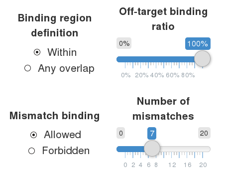

Obviously, a coverage definition allowing for many mismatches would be problematic because it is well known that the efficiency of amplification decreases with the number of mismatches between primers and templates. Hence, when evaluating coverage with allowed mismatches, another criterion is required. This is where the extended coverage conditions come into play. The purpose of these criteria is to select only those coverage events that are likely to represent actual amplification events and to postulate further constraints on the binding modes of the primers.


### Extended coverage conditions

When allowing for multiple mismatches between primers and templates it is crucial that suitable extended coverage conditions are chosen in order to call only coverage events representing actual amplification events rather than false alarms. The extended coverage conditions can be divided into two groups: conditions that are associated with the success of amplification (*binding conditions*) and conditions posulating additional requirements for calling coverage events(*codon design*). The following binding conditions are available:

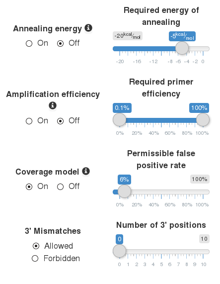

You can activate or deactivate an extended coverage condition by switching the corresponding radio button to *On* or *Off*. You can think of each binding conditions as a filter on the called coverage events. The more stringent the binding crtieria are, the fewer false positive coverage events are called, however, at the risk of also discarding some actual amplification events. 

For example, the free energy of annealing provides the energy that is released when a primer and a template form a duplex. Hence, the lower this energy is, the ore likely it becomes that the primer and the template are present in a duplex. By selecting a cutoff on the free energy of annealing between primers and templates, you can either more stringently select binding events (small cutoff, e.g. -10 kcal/mol) or less stringently (high cutoff, e.g. -5 kcal/mol).

Since the success of amplification also depends on the binding of the polymerase, it is important to consider terminal mismatches as well. For this purpose, you could add the *3' Mismatches* criterion (e.g. to remove coverage events exhibiting mismatches in terminal hexamers) or you could choose a model that takes into account both, the likelihoods of of binding and elongation. `Amplification efficiency` provides the thermodynamic model of [DECIPHER](https://bioconductor.org/packages/release/bioc/html/DECIPHER.html), while `Coverage model` is based on a novel logistic regression model that estimates the false positive rate (FPR) of called coverage events. For example, at an FPR cutoff of 5%, the percentage of falsely called coverage events should be at most 5%. 

The codon design options specify under which conditions mismatch binding events are allowed. For example, it is possible to exclude mismatch binding events that would introduce stop codons or other mutations into the amino acid sequence corresponding to the amplicons.

## Constraints

Using the constraints panel, you can select which primer properties are computed and you can define constraints on each property, which define the desired target values for a property. The *Setting* column defines the desired values for every property such that a primer is considered to pass a constraint if its property values are within the specified range; otherwise the primer is considered to fail the constraint. The *Limit* column is important for the primer design procedure where the defined constraint ranges may be adjusted in order to reach the target coverage. Let us consider the setting for the GC clamp in the following screenshot to obtain a better understanding of such a relaxation:

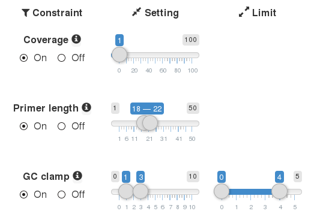

Since the GC clamp target range is [1,3] and its limit is set to [0,4], the design procedure would adjust the target range from [1,3] to [0,4] in the first relaxation, from [0,4] to [0,5] in the second relaxation, and so on. Hence, the difference between the target range and its limit defines the step size during individual relaxations. You can prevent the relaxation of individual constraints in the design procedure by setting the constraint limit to the same value as the target range. Properties for which no limits can be specified are never relaxed (e.g. primer length).

## PCR conditions

The PCR conditions should match the conditions under which the PCR is to be performed in the laboratory. Specifying the PCR conditions correctly is important because the thermodynamic computations that are required for some primer peropties require the concentrations of the ions that are used for PCR. If you do not specify an annealing temperature, *openPrimeR* will automatically select suitable annealing temperatures for evaluating the primers. 

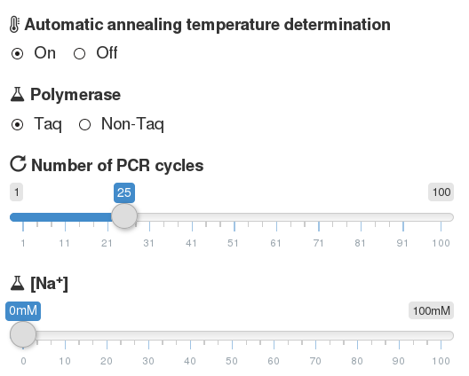

# Evaluation of a set of primers

When evaluating a set of primers, the two most important functions are computing the priemr properties and filtering the set of primers.

Computing the properties of a primer set means that the primer set is evaluated according to all active constraints. Each primer is then annotated with the constraints that it passed (within the constraints) and those constraints that it failed (outside the constraints). Filtering, on the other hand, retains only those primers fulfilling all constraints; primers breaking any of the active constraints are discarded. You can switch between the results from computing the properties of the primers and filtering by selecting *All data* or *Filtered data* in the set selector, respectively.

A basic, tabular overview of the properties of the primers can be obtained from the primers tab:

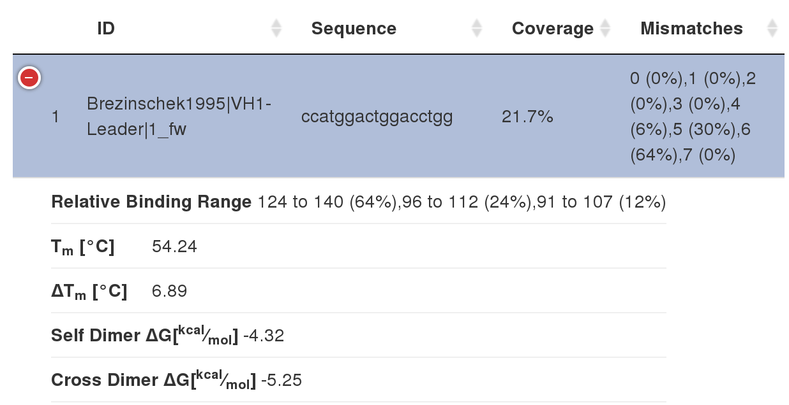

In this case, we see the following information:

* **Coverage:** The percentage of templates that are covered by the primer.
* **Mismatches:** The number of mismatches between the primer and the templates.
* **Relative Binding Range:** The primer's binding positions relative to the target binding range in the templates.
* **$T_m$**: The melting temperature of the primer.
* **$\Delta T_m$**: The maximal absolute melting temperature difference between the selected primer and another primer.
* **Self Dimer $\Delta G$**: The free energy of self dimerization.
* **Cross Dimer $\Delta G$**: The smallest free energy of a cross-dimerizing conformation.

## The coverage tab

You can investigate the coverage using the coverage tab. For example, the coverage tab provides information on the number of covered templates per group, the coverage of individual primers, and the binding regions of the primers. 

The first page of the coverage tab gives an overview of the number of sequences that are covered per group of templates under different coverage conditions. The *expected coverage* provides the number of templates that is expected to be covered under the current coverage constraints. The *identity coverage* on the other hand, only considers coverage events from primers that bind without any mismatches. The provided coverage visualization shows three types of bars: light blue bars show the highly stringent identity coverage, dark blue bars show the expected coverage (allowing for mismatches), and grey bars indicate the number of available template sequences.

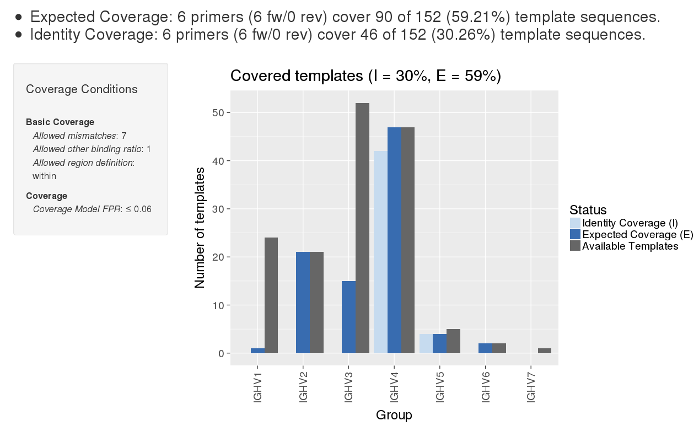

In the illustrated plot, we can see that the loaded primer set has nearly 60% coverage. However, the primer set particularly lacks coverage of the template groups IGHV1, IGHV3, and IGHV7. We also find that only IGHV4 and IGHV5 have high identity coverages, which could indicate lower PCR efficiencies for the other groups of templates.

## The constraints tab

Using the constraints tab, you can gain insights into the properties of the primers and whether they fulfill the current constraints. 

The first page of the constraints tab provides the melting temperature range of the primers and uses a matrix-style visualization to show the constraints that are fulfilled by individual primers (blue) and those that are broken (red). The plot features a p-value that indicates how likely it is to find a primer set whose rate of constraint fulfillment is higher than the fulfillment rate of a collection of reference primer sets from the literature by chance. Hence, primer sets with significant p-values indicate primer sets that fulfill the defined constraints extraordinarily well. 

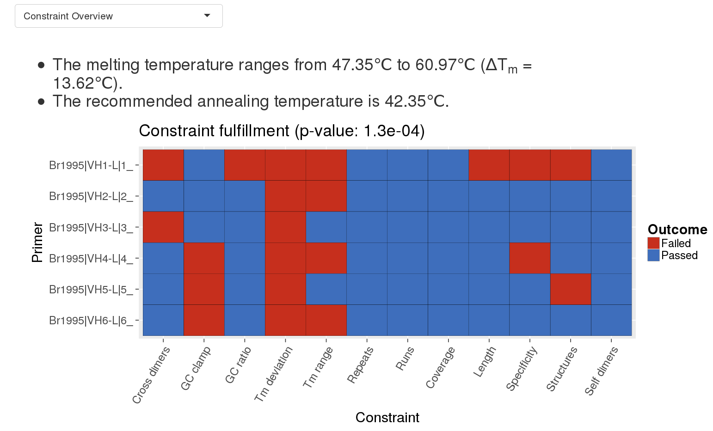

Looking at the exemplary constraint fulfillment plot, we can see that the primer set breaks several constraints. Most markedly, however, the allowed maximal difference in melting temperatures is broken by every primer in the set.

# Comparing primer sets

A single click on the *Compare primer sets* button suffices to compare multiple primer sets in a side-by-side fashion. 

For example, we can visualize the binding positions of the primers relative to the target binding region. In this plot, each primer set corresponds to one facet. The x-axis provides the position in the templates and the y-axis indicates the number of coverage events. At the bottom of each plot, a blue rectangle and a red rectangle is shown. The blue rectangle indicates the target binding region and the red rectangle indicates the region following the target binding region. The number of coverage events are plotted as bars whose color correspond to individual primers. The extent of the bars indicates the binding positions of the primers. 

In the following plot, we have compared the binding regions of primers that we designed for IGHV and primers that were developed by Scheid et al. 

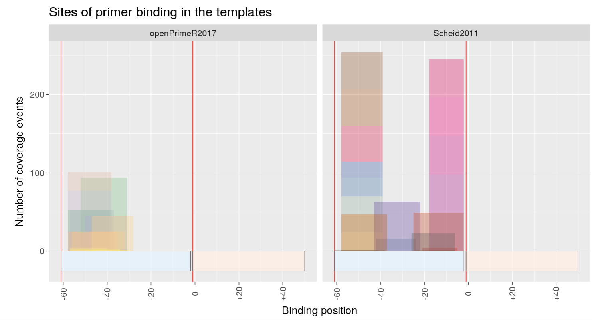

Since we have defined the leader as the target region, the blue rectangle indicates the leader as the binding region. Based on the plot, we can clearly see that both sets of primers target the same region. One difference, however, is that our primers bind only to the start of the leader, while the primers designed by Scheid et al. span the full range of the leader. We can also see that the set from Scheid et al. has a larger number of coverage events (higher bars) than our set.

Apart from the regions of binding, another interesting aspect to analyze is the rate and degree at which the primers in individual sets deviate from the constraints. To exemplify this task, we will use the constraint deviation plot. This plot shows the absolute deviation of each primer from every constraint as a box plot, where the lower end of the box indicates the first quartile, the horizontal line indicates the median, and the upper end of the box indicates the third quartile. The deviations for each constraint are shown in a specific color.

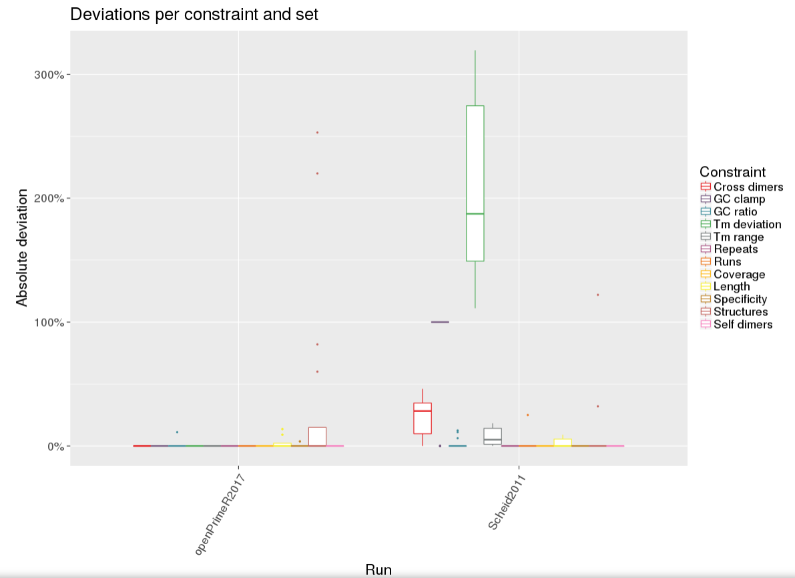

In this case, the plot reveals that the set from Scheid has greater deviations from the specified constraints than our primer set. The two constraints that deviate most from the desired values are the GC clamp and the maximal difference between the melting temperatures of two primers in a set. 

By comparing multiple primer sets, it is possible to quickly identify the benefits and disadvantages of primer sets on multiple levels. For example, our analysis revealed that both analyzed primer sets target different parts of the same region. Moreover, we saw that the set from Scheid et al. had a larger number of coverage events but broke several constraints. Particularly the large difference in the melting temperatures of the primers could lead to problems during PCR.

# Designing primer sets

When designing primers, you can either select a greedy algorithm or an integer linear program for solving the set cover problem. The greedy algorithm guarantees a faster runtime but may yield larger primer sets than the integer linear program, which, however may require more time. 

Having selected an optimization algorithm, you should think about whether you would like to relax the defined constraints in order to reach a certain coverage. If you would like to relax the constraints in order to obtain a coverage of 100%, then no adjustments are necessary. If you require only a smaller coverage of templates, you may change the target coverage, which defines the coverage rate at which the relaxation procedure is triggered. If you do not want to relax the constraints at all, you can disable the constraint relaxation completely. Note, however, that in this case there are no guarantees on the coverage of the designed primer set.

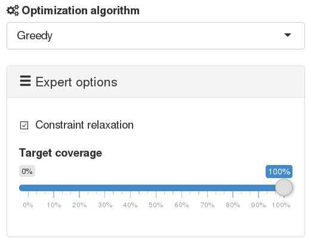

Having defined the primer design settings, you can click on *Design primers* to create a new set of primers. Upon clicking this button, the app will open a pop-up for verifying the design parameters. You can also estimate the difficulty of the primer design problem. Here, *difficulty* refers to the expected number of primers that are required to cover the templates. For example, a set of templates that can be covered by four primers poses an easy primer design problem, while a set of templates requiring 50 primers for full coverage poses a hard primer design problem. To check the difficulty of your primer design problem, you can click on *Evaluate problem difficulty*. Once the computations are complete, a traffic light will be displayed such that easy problems correspond to a green, intermediate problems to a yellow, and hard problems to a red light.

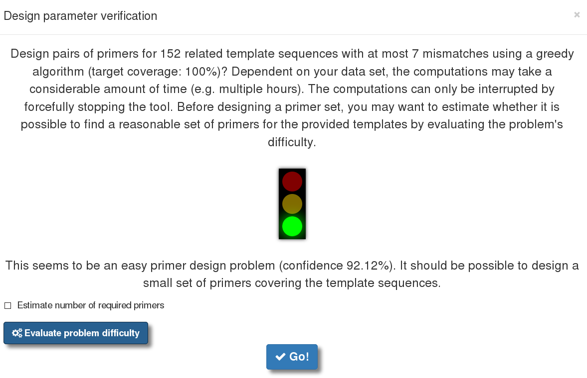

In this case, a green light is displayed. This means that everythingi s fine and we can go ahead with designing primers. However, in case of a red light, one should consider modifying the posed primer design problem, for instance by selecting a subset of templates such that a reasonably-sized set of primers can be generated. The primer design procedure is started by clicking on the *Go!* button. After the computations are finished, the properties of the designed primer set can be investigated in the same way as when evaluating an existing set of primers as described earlier.

# Creating reports

Using the download panel, it is possible to store many of the results that are generated by the app. Most importantly, the app is able to generate PDF reports for the evaluation (*Evaluation Report*) and comparison (*Comparison Report*) of primer sets. The next image shows an excerpt from the first page of the comparison report:

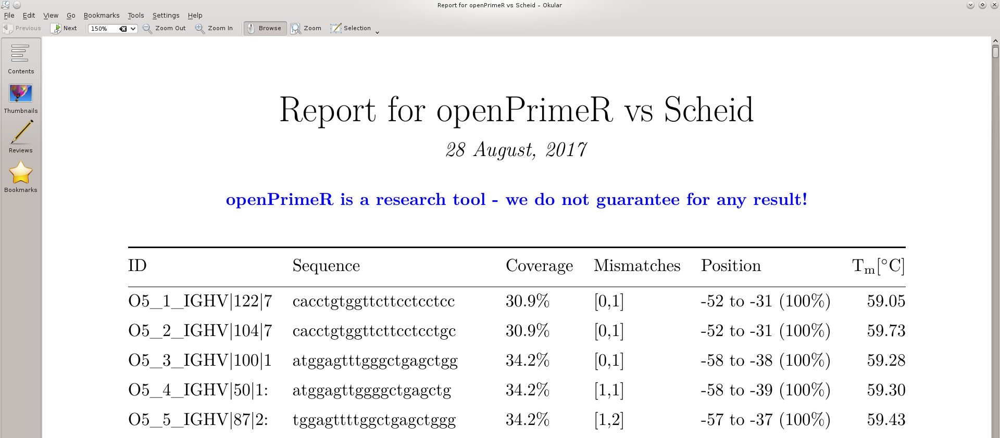
